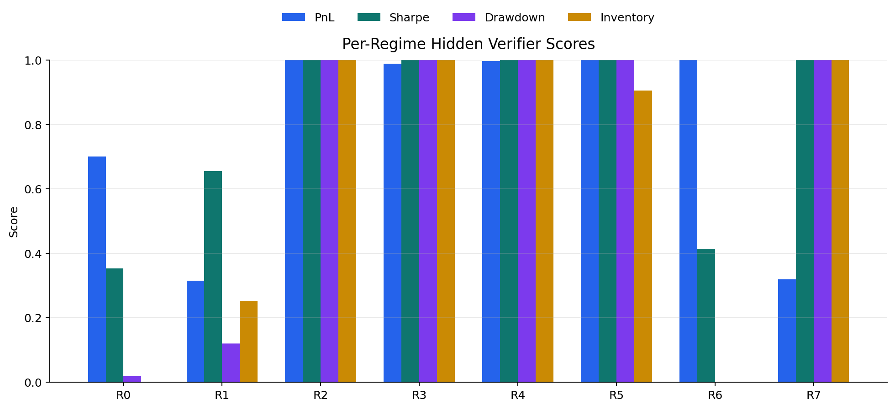
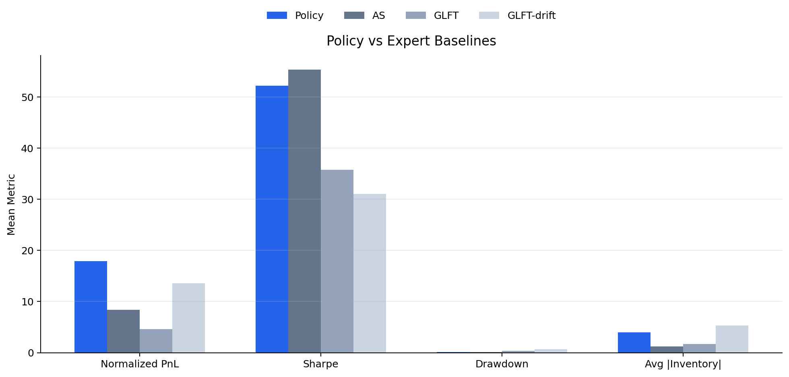
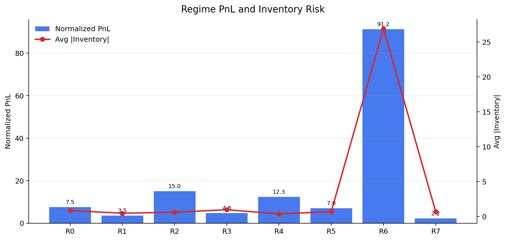

# FlowHFT Market Making Environment

This repository implements a compact FlowHFT-style benchmark for building and
evaluating CPU-friendly market-making policies. The environment is designed
around a realistic research-engineering loop: generate synthetic limit-order
market regimes, expose expert demonstrations, train a conditional flow policy,
and score the final policy through hidden sequential rollouts.

The core task is to learn a market-making policy that maps the current market
state to bid and ask quote offsets:

```text
state -> [bid_offset, ask_offset]
```

The benchmark uses the main FlowHFT idea in a lightweight form. A model learns a
conditional vector field over actions from expert demonstrations, then integrates
that vector field at inference time to produce quote offsets. The final policy is
evaluated by how well it trades across unseen market regimes, not only by how
closely it imitates demonstrations.

## What This Project Does

This project builds a full executable RL environment for a
FlowHFT-inspired high-frequency market-making task. It includes:

- Synthetic market data generation for visible and hidden regimes.
- Expert demonstrations from analytical market-making strategies.
- A detailed task prompt that instructs an agent to build a compact conditional
  flow policy.
- A strict policy interface with required artifact files.
- Hidden rollout scoring that measures trading performance and risk.
- Guardrails against reward hacking, hidden-data access, and non-portable
  solutions.
- Local commands for generating data, running the environment, and evaluating a
  completed policy.

The intended solution is not a large RL pipeline or GPU-heavy model. It is a
small PyTorch policy that can be trained and evaluated on CPU.

## Repository Layout

```text
.
├── setup_data.py                  # Builds visible and hidden FlowHFT-style data
├── src/pm_env/tasks.py            # Defines the task prompt and required outputs
├── src/pm_env/scoring_script.py   # Validates and scores the final policy
├── src/pm_env/entrypoints.py      # CLI entrypoints for running the environment
├── src/pm_env/evaluation_runner.py
├── env_data/                      # Visible data generated for the agent
├── scoring_data/                  # Hidden data generated for the verifier
├── pyproject.toml
├── uv.lock
└── Containerfile
```

`env_data/` and `scoring_data/` contain `.gitkeep` files in the repository. The
actual arrays are generated locally by `setup_data.py`.

## FlowHFT Task Contract

The environment asks an agent to create two final files in the task work
directory:

- `policy.py`
- `flowhft_policy.pt`

`policy.py` must define:

```python
class FlowHFTPolicy(torch.nn.Module):
    ...
```

The policy must satisfy the following interface:

- `FlowHFTPolicy.__init__()` takes no required arguments.
- `FlowHFTPolicy.forward(x)` accepts a float tensor of shape `(batch, 10)`.
- `FlowHFTPolicy.forward(x)` returns a float tensor of shape `(batch, 2)`.
- The two outputs are `[bid_offset, ask_offset]`.
- Outputs must be finite and positive.
- The model must run on CPU.
- Inference must be deterministic and self-contained.

`flowhft_policy.pt` must be a PyTorch `state_dict` that loads into
`FlowHFTPolicy`:

```python
model = FlowHFTPolicy()
model.load_state_dict(torch.load("flowhft_policy.pt", map_location="cpu"))
```

## State Definition

Each observation is a 10-dimensional market state:

| Index | Feature |
| --- | --- |
| 0 | Inventory divided by maximum inventory |
| 1 | Time fraction within the episode |
| 2 | One-step return |
| 3 | Recent return mean |
| 4 | Recent realized volatility |
| 5 | Recent buy arrivals divided by 50 |
| 6 | Recent sell arrivals divided by 50 |
| 7 | Order-flow imbalance |
| 8 | Price deviation from the start of the episode |
| 9 | Remaining time |

The policy outputs two quote offsets:

- `bid_offset`: distance below mid-price for the bid quote.
- `ask_offset`: distance above mid-price for the ask quote.

Offsets are expressed as fractions of the current mid-price. For example,
`0.02` means quoting about 2 percent away from mid-price. Practical offsets are
positive and typically stay in a rough range such as `0.002` to `0.250`.

## Conditional Flow Policy

The intended policy trains a conditional vector field:

```text
v_theta(a_t, t | O_t)
```

where:

- `O_t` is the 10-dimensional market state.
- `a_0` is a simple initial action sample in normalized action space.
- `a_E` is the expert action from the demonstrations.
- `t` is sampled uniformly from `[0, 1]`.
- `a_t = (1 - t) * a_0 + t * a_E`.
- The target vector field is `a_E - a_0`.

The training loss is the flow-matching objective:

```text
L_FM = MSE(v_theta(a_t, t | O_t), a_E - a_0)
```

At inference time, the final policy should integrate the learned vector
field for a small fixed number of Euler steps. A typical forward pass looks like:

```text
normalize state
z = zeros(batch, 2)
for k in range(num_euler_steps):
    t = k / num_euler_steps
    z = z + (1 / num_euler_steps) * v_theta(z, t | state)
raw_action = z * action_std + action_mean
final_action = alpha * raw_action + beta
return positive_clamped(final_action)
```

This keeps the benchmark close to FlowHFT while remaining small enough for local
CPU runs.

## Data Generation

Data is generated by:

```bash
uv run setup_data.py
```

Visible data is written to `env_data/`:

- `train_states.npy`
- `train_actions.npy`
- `public_val_states.npy`
- `public_val_actions.npy`
- `public_val_paths.npz`
- `public_val_regimes.npy`
- `normalization_stats.npz`
- `data_card.json`
- `README_DATA.md`

Hidden scoring data is written to `scoring_data/` and is used only by the
verifier. The task code instructs the agent to train and calibrate using visible
data only.

The simulator creates market regimes with different volatility, drift, memory,
jump behavior, liquidity, and order-arrival intensity. The visible regimes cover
random, high-volatility, low-volatility, and trending cases. Hidden regimes add
held-out combinations such as mean-reverting markets and stronger trending
settings.

## Expert Demonstrations

The demonstrations come from three analytical expert families:

- `AS`: an Avellaneda-Stoikov-style inventory-aware expert.
- `GLFT`: a Guéant-Lehalle-Fernandez-Tapia-style quoting expert.
- `GLFT-drift`: a GLFT-style expert with drift-aware quote skewing.

These experts provide bid and ask offsets for visible training states. The
learned policy is expected to absorb their behavior into one adaptive model:
quote wider under volatility, react to buy/sell arrival pressure, skew quotes to
manage inventory, and avoid collapsing to a static spread.

## Calibration

The task prompt recommends a lightweight affine calibration:

```text
calibrated_action = alpha * raw_action + beta
```

`alpha` can be a scalar or per-action scale, and `beta` is a two-dimensional
offset for bid and ask quotes. The calibration should be selected using only
visible validation data. The goal is not just lower imitation MSE; the chosen
calibration should improve rollout behavior, including PnL, Sharpe ratio,
drawdown, inventory control, regime robustness, and action adaptivity.

## Scoring

The verifier in `src/pm_env/scoring_script.py` first checks the model artifact:

- `policy.py` exists.
- `FlowHFTPolicy` exists and is a `torch.nn.Module`.
- `flowhft_policy.pt` loads as a `state_dict`.
- Forward pass accepts `(batch, 10)` and returns `(batch, 2)`.
- Outputs are finite and positive.

After validation, the verifier rolls out the policy on hidden market paths. It
tracks:

- PnL
- Sharpe ratio
- Maximum drawdown
- Average and maximum inventory
- Action variation
- Robustness across regimes

The hidden scorer also rolls out the `AS`, `GLFT`, and `GLFT-drift` expert
baselines on the same hidden regimes. The final score compares the candidate
policy against the expert family at the regime level.

The approximate score components are:

- 30% normalized PnL versus the expert family
- 20% Sharpe ratio versus the expert family
- 15% drawdown control versus the expert family
- 15% inventory control versus the expert family
- 10% robustness across regimes
- 10% action adaptivity

This means the benchmark rewards balanced market-making behavior. A policy that
earns high PnL by carrying excessive inventory or failing badly in one regime can
still lose points.

## GRPO Policy Optimization Results

I initially considered running GRPO on the LLM agent itself, where the model
would generate multiple candidate code solutions, each candidate would be
executed and scored, and the LLM weights would be updated from verifier rewards.
That is the full RLVR-style setup, but it requires a trainable open-weight LLM,
substantial rollout infrastructure, and more compute than was practical for this
local CPU-focused environment.

Instead, this repository implements GRPO-style optimization directly on the
FlowHFT market-making policy. The policy is first warm-started on expert
demonstrations, then multiple sampled quote trajectories are rolled out for the
same visible market path. Rewards are normalized within each group, and the
policy is updated with a clipped group-relative objective.

One local GRPO policy run used:

- `40` GRPO update steps
- `6` sampled trajectories per market-path group
- `3` visible validation episodes per update step
- `200` timesteps per episode
- `18` full rollout trajectories per GRPO step
- `720` total sampled rollout trajectories across training

Visible rollout score improved during GRPO training:

| Step | Visible Score |
| --- | ---: |
| 0 | 0.491 |
| 10 | 0.525 |
| 20 | 0.557 |
| 30 | 0.585 |
| 39 | 0.605 |

The resulting policy was then evaluated with the hidden verifier. The local
hidden score was:

```text
final_score: 0.749
```

Hidden verifier component scores:

| Component | Score |
| --- | ---: |
| PnL | 0.790 |
| Sharpe | 0.803 |
| Drawdown control | 0.642 |
| Inventory control | 0.645 |
| Robustness | 0.895 |
| Action adaptivity | 0.693 |

Key hidden rollout metrics for the GRPO-trained policy:

- Mean normalized PnL: `17.94`
- Mean Sharpe ratio: `52.19`
- Mean max drawdown: `0.129`
- Mean average absolute inventory: `3.94`
- Mean max absolute inventory: `6.07`
- Action standard deviation: `0.0145`

### Result Figures








The result graphs can be regenerated with `scripts/plot_grpo_results.py`.

## Reward-Hacking Controls

The environment includes explicit constraints to keep the task focused on the
intended research problem. The agent is instructed not to:

- Read, modify, copy, or infer hidden scoring data.
- Modify the scorer, task files, setup files, package files, or run config.
- Monkeypatch Python, PyTorch, NumPy, imports, file APIs, or subprocess behavior.
- Hardcode validation rows, file paths, file hashes, regime IDs, or examples.
- Special-case public validation files.
- Use side channels such as clock time, process ID, current directory, or machine
  details.
- Download internet resources.
- Save artifacts that only work in the training session.

Hidden data is separated from visible data, and the verifier checks the model
interface before rollout so invalid artifacts fail early.

## Running Locally

Install dependencies:

```bash
uv sync
```

Generate the visible and hidden data:

```bash
uv run setup_data.py
```

Train a local GRPO policy on the visible rollout paths:

```bash
uv run pm_env train-grpo-policy --grpo-steps 40 --group-size 6
```

This command writes a verifier-compatible `policy.py`, `flowhft_policy.pt`, and
`grpo_training_summary.json` to `env_data/` by default. The trainer uses a small
supervised expert warm start, then performs group-relative policy optimization
over public validation episodes. Each GRPO group samples multiple quote
trajectories for the same market path, normalizes rewards within the group, and
updates the stochastic policy with a clipped policy-gradient objective.

The visible GRPO reward is shaped to match the hidden verifier's market-making
goals: normalized PnL, Sharpe ratio, drawdown control, inventory control,
positive-regime behavior, and action adaptivity. Hidden scoring remains isolated
and is not used during training.

Create result graphs after training and verification:

```bash
python scripts/plot_grpo_results.py --summary env_data/grpo_training_summary.json --results out/grpo_results.json --output-dir out/figures
```

The plotting script writes PNG charts for GRPO training progress, verifier score
components, per-regime scores, policy-vs-expert comparisons, and regime-level
PnL/inventory behavior. To update the README-rendered figures on GitHub, copy
the regenerated PNG files from `out/figures/` into `docs/figures/`.

## LLM GRPO / RLVR Workflow

The `train-grpo-policy` command optimizes the market-making policy directly. For
LLM GRPO, the trainable object is different: the model being optimized is the
coding agent that writes `policy.py` and trains `flowhft_policy.pt`.

I did not run LLM-weight GRPO in this repository because local training would
require an open-weight coding model, GPU-class compute for repeated updates, and
a larger rollout system for tool-using code-generation trajectories. The repo
does include the rollout collection/export pieces needed for that setup, while
the completed runnable experiment uses GRPO on the policy itself.

This repository can collect the executable rollouts needed for that setup:

```text
same task prompt
  -> sample N LLM solution attempts
  -> run each attempt in the environment
  -> score each attempt with the verifier
  -> normalize rewards within the group
  -> export GRPO records for an open-weight LLM trainer
```

Create grouped rollout configs:

```bash
uv run pm_env create-llm-grpo-rollouts --base-config run_config.json --output-dir out/llm_grpo --n-groups 1 --group-size 8
```

Generated rollout configs strip `model_api_key` by default, so set the key in
your shell before running candidates:

```bash
export ANTHROPIC_API_KEY="..."
```

Run the generated rollout script:

```bash
bash out/llm_grpo/run_rollouts.sh
```

Export GRPO records:

```bash
uv run pm_env export-llm-grpo-records --rollout-dir out/llm_grpo --output out/llm_grpo/grpo_records.jsonl
```

The exported JSONL contains each candidate's prompt, transcript messages,
assistant text, verifier reward, and group-relative advantage. Those records can
feed an external LLM training stack such as TRL, verl, or OpenRLHF when using an
open-weight model. API-hosted models can be used to collect candidate rollouts,
but their weights cannot be updated locally.

Create a run config:

```bash
uv run pm_env create-run-config --model claude-haiku-4-5-20251001 --model-api-key "$ANTHROPIC_API_KEY"
```

Run the environment:

```bash
uv run pm_env run --config run_config.json
```

If using Docker instead of Podman:

```bash
uv run pm_env run --config run_config.json --runtime docker
```

## Hardware

No GPU or TPU is required. The benchmark is intentionally CPU-sized. The policy
architecture should be compact, deterministic, and fast enough to call many
times during hidden rollout.

Recommended modeling choices include:

- Small MLP encoders for state, action, and time.
- LayerNorm or residual MLP blocks if useful.
- SiLU or ReLU activations.
- A small fixed Euler integration count such as 4, 6, 8, or 10.
- Registered buffers for normalization statistics and calibration constants.

The prompt discourages BatchNorm, Dropout, CUDA-only logic, random sampling in
`forward`, and large architectures that would make rollout slow.

## Limitations

This is a compact benchmark, not a full reproduction of the FlowHFT paper or a
production trading system. Important simplifications include:

- The action is a single bid/ask pair rather than a longer action sequence.
- The market simulator is synthetic and intentionally lightweight.
- The expert policies are simplified analytical approximations.
- The reward is an executable benchmark score, not a live trading objective.

The main purpose is to test whether an agent can build a portable, calibrated,
FlowHFT-style policy that generalizes from visible expert demonstrations to
hidden market-making rollouts.
