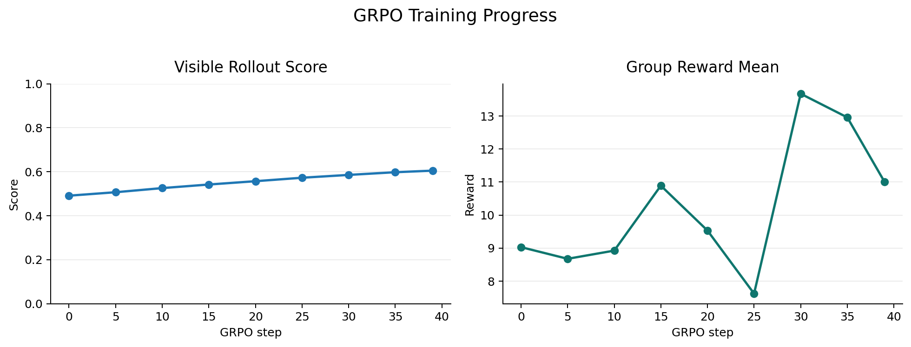
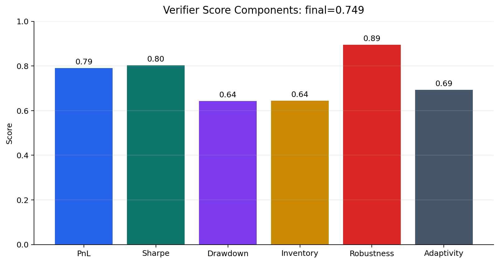

# Executable RL Environment for FlowHFT Market Making

This repository is an executable reinforcement learning environment for training
and evaluating tool-using AI agents. An LLM receives a research task, works in
an isolated container, inspects visible data, writes code, trains a model, and
submits artifacts. A verifier that the agent cannot access then executes those
artifacts on hidden data and converts their performance into a reward.

The current research task is a CPU-friendly, FlowHFT-inspired market-making
problem. The environment is the main contribution: the market-making task is one
concrete example of how the framework can turn a research objective into an
executable, reward-producing agent task.

```text
task definition
    -> isolated LLM agent with tools
    -> code and model artifacts
    -> hidden executable verifier
    -> scalar reward and diagnostics
    -> transcript or grouped RL training records
```

## 1. How the RL Environment Works

### The execution lifecycle

One environment run follows this sequence:

1. `setup_data.py` generates visible environment data and private scoring data.
2. `tasks.py` gives the LLM its instructions, tool list, artifact contract, and
   judge.
3. `entrypoints.py` builds and launches an isolated container.
4. `evaluation_runner.py` sends the task to the configured LLM and streams its
   responses.
5. The LLM uses registered MCP tools to inspect data, write code, run training,
   and test its solution.
6. When the LLM stops requesting tools, the executable judge invokes the hidden
   verifier.
7. The verifier validates the submitted artifacts, evaluates them on hidden
   data, and emits a reward.
8. Messages, tool calls, token usage, errors, and scoring events are written to
   a transcript.

This is an RL environment for an agent that produces and executes a solution,
not only a library function that returns observations and rewards through
`step()`. The complete agent trajectory is evaluated by the quality of its final
artifacts.

### Main components

| Component | Responsibility |
| --- | --- |
| `src/pm_env/tasks.py` | Defines the task prompt, available tools, required artifacts, and judge |
| `src/pm_env/evaluation_runner.py` | Runs the LLM/tool loop and records structured events |
| `src/pm_env/mcp_servers/` | Registers and serves tools to the agent through MCP |
| `src/pm_env/tools/` | Provides controlled shell, submission, and image-inspection tools |
| `src/pm_env/judges/` | Implements executable, rubric, and regex-based evaluation |
| `src/pm_env/scoring_script.py` | Validates and scores the FlowHFT artifacts on hidden rollouts |
| `src/pm_env/schemas/` | Defines configs, messages, transcripts, scoring results, and run state |
| `src/pm_env/run_helpers.py` | Builds containers, configures isolation, and streams events |
| `Containerfile` | Creates separate model and verifier execution contexts |
| `env_data/` | Visible files copied into the agent's work directory |
| `scoring_data/` | Private files available to the root-owned verifier only |

### Agent tools and interaction

The task chooses which tools the agent receives. In this project, the primary
tool is a persistent Bash session. Commands execute as the unprivileged `model`
user inside `/workdir`, where the agent can read the visible dataset and create
its solution.

The evaluation runner continues alternating between model responses and tool
execution until the model returns a response with no additional tool calls. It
then invokes the judge. This lets the LLM perform a full research-engineering
loop rather than return a single text answer.

Every run produces structured events such as:

- Task and step start/completion
- Model messages and streaming chunks
- Tool-call start and completion
- Token usage
- Errors
- Verifier scoring

By default, the transcript is saved to `out/transcript.json`. It provides an
auditable record of what the LLM attempted and how the verifier reached the
final reward.

### Isolation, access denial, and least privilege

The agent and verifier do not run with the same permissions.

- The LLM's commands are demoted to a dedicated `model` user.
- The model works in `/workdir` and receives only the contents of `env_data/`.
- Environment source, verifier code, dependencies, and hidden data live under
  the root-owned `/pm_env` directory.
- `/pm_env` is set to permission mode `0700`, denying the model user directory
  listing and file access.
- `check_scoring_data_permissions.py` actively verifies that root can read the
  scoring files while the model user cannot list or read `/pm_env`,
  `/pm_env/scoring_data`, or `/pm_env/.venv`.
- Outbound traffic from the model user is rejected by container firewall rules,
  apart from explicitly allowed local and infrastructure networks.
- The verifier runs after the agent finishes, using the private environment and
  scoring data that were never exposed in the agent work directory.

These denials are part of the environment contract. A failed request for hidden
files should be denied by the operating system, not merely discouraged by the
prompt.

### Reward hacking controls

Executable environments create a broader attack surface than static question
answering. A coding agent might try to obtain reward without solving the
intended research problem. This environment addresses that at several layers.

**Filesystem and process controls**

- Hidden scoring data and verifier source are owned by root and inaccessible to
  the model user.
- The agent cannot replace the installed verifier from its writable work
  directory.
- The final model must be represented by portable files rather than relying on
  live state from the training process.

**Network controls**

- General outbound network access is denied to the model user.
- The task prohibits downloading pretrained artifacts or external answers.

**Task-level integrity rules**

The prompt explicitly prohibits:

- Reading, copying, modifying, deleting, or inferring hidden scoring data
- Modifying the scorer, task definition, setup code, package files, or run config
- Monkeypatching Python, PyTorch, NumPy, imports, file APIs, or subprocesses
- Hardcoding public validation rows, regime IDs, paths, hashes, or examples
- Special-casing validation files
- Using clock time, process ID, current directory, machine details, or hidden
  file existence as side channels
- Producing artifacts that only work inside the original training process

**Verifier controls**

Before scoring behavior, the verifier checks that the required files exist,
that the submitted class is a `torch.nn.Module`, that the checkpoint is a real
`state_dict`, and that inference has the required shape and finite positive
outputs. Invalid, nonportable, or non-executable artifacts fail early.

No defense is perfect. The design goal is defense in depth: prompt constraints,
OS permissions, user separation, network restrictions, interface validation,
hidden evaluation, and a complete audit transcript.

### What produces the reward

Each task step owns a judge. For this project, an `ExecutableJudge` runs the
FlowHFT scoring script against the submitted model files. The judge returns a
scalar score plus metadata. The evaluation runner records this as a scoring
event and uses the judge's continuation decision to pass, fail, or continue the
task.

This makes the verifier the source of reward. The LLM's explanation, confidence,
or claimed training metrics do not determine success.

## 2. The Research Task: Adaptive Market Making

The research question is whether an AI agent can build a compact policy that
combines expert market-making behavior and generalizes across unseen synthetic
market regimes.

The policy maps a ten-dimensional market observation to two quote offsets:

```text
market state -> [bid_offset, ask_offset]
```

The intended solution uses the main FlowHFT idea in lightweight form. It learns
a conditional vector field over quote actions from analytical expert
demonstrations, then integrates that field at inference time. Evaluation is
based on sequential trading behavior, not only imitation loss.

This is a synthetic CPU-scale research benchmark. It is not a production
trading system, a claim of live profitability, or a complete reproduction of
the FlowHFT paper.

### Market state and action

| Index | Observation feature |
| --- | --- |
| 0 | Inventory divided by maximum inventory |
| 1 | Time fraction within the episode |
| 2 | One-step return |
| 3 | Recent return mean |
| 4 | Recent realized volatility |
| 5 | Recent buy arrivals divided by 50 |
| 6 | Recent sell arrivals divided by 50 |
| 7 | Order-flow imbalance |
| 8 | Price deviation from episode start |
| 9 | Remaining time |

The two actions are positive fractional distances from the current mid-price:

- `bid_offset`: distance below mid-price for the bid quote
- `ask_offset`: distance above mid-price for the ask quote

For example, an offset of `0.02` places a quote approximately two percent away
from mid-price. Practical actions are clipped to a range such as `0.002` to
`0.250`.

### Data generation and hidden regimes

Run:

```bash
uv run setup_data.py
```

The generator creates synthetic price paths and order arrivals with varying:

- Volatility and drift
- Trend and mean reversion
- Jump probability
- Liquidity and arrival intensity
- Self-exciting and cross-exciting order flow
- Episode time step

Visible training and validation files are written to `env_data/`. Held-out paths
are written to `scoring_data/`. The hidden suite contains regime combinations
that are not exposed to the agent.

### Expert demonstrations

Visible actions come from three analytical strategy families:

- `AS`: Avellaneda-Stoikov-style inventory-aware quoting
- `GLFT`: liquidity and order-flow-sensitive quoting
- `GLFT-drift`: GLFT-style quoting with directional drift adjustment

The objective is to learn one adaptive policy that can widen quotes under
volatility, respond to order-flow pressure, skew quotes to control inventory,
and remain useful across regimes.

### Conditional flow-matching objective

For observation `O_t`, expert action `a_E`, base action `a_0`, and interpolation
time `t`:

```text
a_t = (1 - t) * a_0 + t * a_E
target = a_E - a_0
L_FM = MSE(v_theta(a_t, t | O_t), target)
```

At inference time, the policy starts from a fixed normalized action and performs
a small number of Euler integration steps through the learned vector field. A
lightweight affine calibration may then adjust the raw action using visible
validation rollouts.

### Artifact contract

The LLM must produce:

- `policy.py`
- `flowhft_policy.pt`

`policy.py` must define a no-argument `FlowHFTPolicy` class whose forward method
maps `(batch, 10)` float tensors to `(batch, 2)` finite positive quote offsets.
The checkpoint must be a `state_dict` that loads on CPU:

```python
model = FlowHFTPolicy()
model.load_state_dict(
    torch.load("flowhft_policy.pt", map_location="cpu", weights_only=True)
)
```

Inference must be deterministic, self-contained, and fast enough for repeated
hidden rollouts.

### Hidden verifier

After interface validation, the verifier executes the candidate and the three
expert baselines on the same hidden regimes. It measures:

- Normalized PnL
- Step-return Sharpe ratio
- Maximum drawdown
- Average and maximum absolute inventory
- Positive performance across regimes
- Variation in the submitted actions

The approximate score is:

| Component | Weight |
| --- | ---: |
| Regime-level PnL versus experts | 30% |
| Regime-level Sharpe versus experts | 20% |
| Drawdown control versus experts | 15% |
| Inventory control versus experts | 15% |
| Robustness across regimes | 10% |
| Action adaptivity | 10% |

The verifier compares aggregate behavior at the regime level. It does not choose
the best expert retrospectively for every episode. A candidate can therefore
lose points despite high average PnL if it carries excessive inventory, suffers
large drawdowns, collapses to static quotes, or fails in one regime.

## 3. GRPO and RLVR Workflows

There are two distinct objects that could be optimized with GRPO in this
project. Keeping them separate is important.

### GRPO on the market-making policy

The completed local experiment optimizes the PyTorch market-making policy
directly:

1. Warm-start the policy using expert demonstrations.
2. Sample several quote trajectories for the same visible market path.
3. Compute a rollout reward for each trajectory.
4. Normalize rewards within the group to obtain relative advantages.
5. Apply a clipped group-relative policy update.

Run it with:

```bash
uv run pm_env train-grpo-policy --grpo-steps 40 --group-size 6
```

One CPU run used 40 updates, six trajectories per group, three episodes per
update, and 200 timesteps per episode, for 720 sampled trajectories. Its visible
rollout score increased from `0.491` to `0.605`.

The resulting policy received a local hidden score of `0.749`:

| Component | Score |
| --- | ---: |
| PnL | 0.790 |
| Sharpe | 0.803 |
| Drawdown control | 0.642 |
| Inventory control | 0.645 |
| Robustness | 0.895 |
| Action adaptivity | 0.693 |





The figures can be regenerated with `scripts/plot_grpo_results.py`.

### GRPO on the LLM coding agent

In the larger RLVR formulation, the trainable policy is the LLM that writes
`policy.py` and trains `flowhft_policy.pt`:

```text
same research prompt
    -> sample N independent LLM solution trajectories
    -> execute every candidate in an isolated environment
    -> score every candidate with the verifier
    -> normalize rewards within the group
    -> export prompt, trajectory, reward, and advantage
    -> update an open-weight LLM with an external trainer
```

This repository implements rollout collection and record export, but it does
not update hosted API-model weights. Full LLM GRPO requires an open-weight model,
GPU-class training compute, and an external stack such as TRL, verl, or OpenRLHF.

Create and run grouped LLM rollouts:

```bash
uv run pm_env create-llm-grpo-rollouts \
  --base-config run_config.json \
  --output-dir out/llm_grpo \
  --n-groups 1 \
  --group-size 8

export ANTHROPIC_API_KEY="..."
bash out/llm_grpo/run_rollouts.sh
```

Export group-relative training records:

```bash
uv run pm_env export-llm-grpo-records \
  --rollout-dir out/llm_grpo \
  --output out/llm_grpo/grpo_records.jsonl
```

The JSONL records include the task prompt, transcript messages, assistant text,
verifier reward, and group-relative advantage.

## Running the Full LLM Environment

This workflow launches the complete environment. The LLM receives the task,
uses Bash to inspect the visible data, writes and trains a candidate policy, and
then submits that policy to the hidden verifier. It is different from
`train-grpo-policy`, which trains a built-in policy directly without an LLM.

### 1. Install the prerequisites

The full run requires:

- Python 3.12
- `uv`
- Docker or Podman
- An API key for the configured LLM provider

On macOS, one installation path is:

```bash
brew install uv
brew install --cask docker
```

Start Docker Desktop before continuing. Confirm that the required commands are
available:

```bash
uv --version
docker --version
docker info
```

If using Podman instead:

```bash
brew install podman
podman machine init
podman machine start
podman info
```

### 2. Install the project

From the repository root:

```bash
uv sync
uv run pm_env check
uv run pm_env list-tasks
```

The check command confirms that the task and MCP tools are registered. The
container build performs an additional permission test to confirm that the
model user cannot access hidden scoring files.

### 3. Generate visible and hidden data

```bash
uv run setup_data.py
```

This creates two separate data areas:

```text
env_data/       visible training and validation files copied to the LLM
scoring_data/   hidden paths copied into the root-only verifier directory
```

The LLM sees the contents of `env_data/` in `/workdir`. It does not receive
`scoring_data/`.

### 4. Configure the LLM

Set the provider key in the current shell. For the default Anthropic model:

```bash
export ANTHROPIC_API_KEY="..."
```

Create `run_config.json`:

```bash
uv run pm_env create-run-config \
  --model claude-haiku-4-5-20251001 \
  --model-api-key "$ANTHROPIC_API_KEY"
```

Inspect the non-secret fields:

```bash
python -c 'import json; d=json.load(open("run_config.json")); d["model_api_key"]="***"; print(json.dumps(d, indent=2))'
```

`run_config.json` contains the API key when it is passed on the command line. Do
not commit this file. The config also selects the task, model, MCP server, event
stream, and transcript output path.

### 5. Launch the complete agent run

With Docker:

```bash
uv run pm_env run \
  --config run_config.json \
  --runtime docker \
  --keep-containers
```

With Podman:

```bash
uv run pm_env run \
  --config run_config.json \
  --runtime podman \
  --keep-containers
```

`--keep-containers` is recommended when inspecting a run because the model's
generated files remain inside the container after verification. Without this
flag, the temporary container is removed automatically, but the transcript is
still saved on the host.

The first run builds the environment image and can take longer than subsequent
runs. The terminal prints a container name in this form:

```text
pm_env_run_<run-id>
```

### 6. What the LLM does during the run

Inside the container, the following happens automatically:

1. The environment sends the full FlowHFT task prompt to the LLM.
2. The LLM examines visible arrays, metadata, and validation paths with its Bash
   tool.
3. The LLM writes `/workdir/policy.py` containing `FlowHFTPolicy`.
4. The LLM writes a training script or executes inline Python to learn from the
   expert demonstrations.
5. Training produces `/workdir/flowhft_policy.pt`.
6. The LLM checks tensor shapes, finite positive actions, checkpoint loading,
   imitation metrics, and any visible rollout metrics it chooses to compute.
7. When the LLM stops calling tools, the evaluation runner invokes the
   executable judge.
8. The root-owned verifier loads the two artifacts and rolls the policy out on
   hidden regimes.
9. The verifier compares the candidate with AS, GLFT, and GLFT-drift baselines,
   computes the weighted score, and emits a `scoring` event.

The model does not manually call the hidden verifier. Transitioning from the
agent loop to scoring is controlled by `evaluation_runner.py`.

### 7. Watch the agent and verifier

The main terminal streams model messages, tool calls, token usage, errors, and
the final score. The same events are written to `out/transcript.json`.

In a second terminal, show the latest event every two seconds:

```bash
while true; do
  jq -r '.events[-1] | [.timestamp, .type] | @tsv' out/transcript.json
  sleep 2
done
```

After the run, list the LLM's tool calls:

```bash
jq '.events[] | select(
  .type == "tool_call_started" or
  .type == "tool_call_completed"
)' out/transcript.json
```

Show only verifier results:

```bash
jq '.events[] | select(.type == "scoring") | .scoring' out/transcript.json
```

Confirm that the task completed:

```bash
jq '.events[] | select(.type == "task_completed")' out/transcript.json
```

### 8. Copy the LLM-generated model out of the container

Replace `<run-id>` with the identifier printed when the run starts.

For Docker:

```bash
mkdir -p out/llm_workdir
docker cp pm_env_run_<run-id>:/workdir/. out/llm_workdir/
```

For Podman:

```bash
mkdir -p out/llm_workdir
podman cp pm_env_run_<run-id>:/workdir/. out/llm_workdir/
```

Inspect the required model artifacts:

```bash
ls -lh \
  out/llm_workdir/policy.py \
  out/llm_workdir/flowhft_policy.pt
```

The work directory may also contain training scripts, logs, calibration results,
and other files the LLM created while solving the task.

Remove the preserved container when finished:

```bash
docker rm pm_env_run_<run-id>
```

Use `podman rm` for a Podman run.

### 9. Run multiple independent LLM attempts

Containerized execution supports parallel attempts:

```bash
uv run pm_env run \
  --config run_config.json \
  --runtime docker \
  --n-parallel 4
```

Each attempt receives its own run ID and transcript filename. Parallel attempts
consume separate model API calls and may incur significant cost.

### 10. Common failures

- `uv: command not found`: install `uv` and restart the shell.
- Docker daemon errors: start Docker Desktop and verify `docker info` succeeds.
- Authentication errors: export the correct provider API key and recreate the
  run config.
- Missing arrays: run `uv run setup_data.py` before building the container.
- Missing policy artifacts: preserve the container and inspect the transcript
  for failed training commands or model errors.
- No scoring event: inspect the transcript for an `error` event and confirm that
  the task reached `task_completed`.
- Permission-check failure: rebuild without `--dev` and confirm the container
  filesystem was created by the current `Containerfile`.

## Repository Layout

```text
.
├── setup_data.py
├── Containerfile
├── env_requirements.txt
├── src/pm_env/
│   ├── entrypoints.py
│   ├── evaluation_runner.py
│   ├── tasks.py
│   ├── scoring_script.py
│   ├── grpo_trainer.py
│   ├── llm_grpo_rollouts.py
│   ├── judges/
│   ├── mcp_servers/
│   ├── schemas/
│   ├── tools/
│   └── transcript_streaming/
├── env_data/
├── scoring_data/
├── scripts/plot_grpo_results.py
└── docs/figures/
```

## Limitations

- This is an executable agent benchmark, not a standardized Gymnasium API.
- The market simulator is synthetic and intentionally lightweight.
- Expert strategies are simplified analytical approximations.
- The action is one bid/ask pair rather than a longer order sequence.
- The reported Sharpe is a synthetic step-return metric, not a live annualized
  investment-performance claim.
- Hidden evaluation reduces overfitting but cannot eliminate every possible
  reward-hacking strategy.
- The completed GRPO result optimizes the market-making policy directly; LLM
  weight optimization is provided as a rollout/export workflow only.

The broader goal is to study whether tool-using AI agents can produce portable,
executable research artifacts that generalize under hidden evaluation and can be
improved using verifier rewards.
